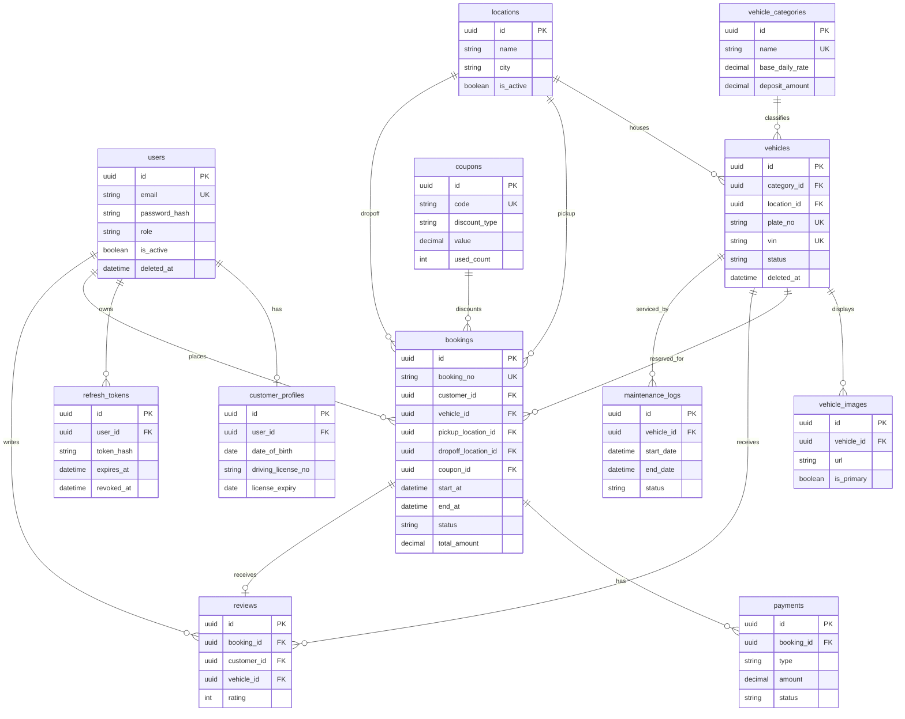

# Entity relationship diagram

```mermaid
erDiagram
  users ||--o| customer_profiles : has
  users ||--o{ refresh_tokens : owns
  users ||--o{ bookings : places
  users ||--o{ reviews : writes
  locations ||--o{ vehicles : houses
  locations ||--o{ bookings : pickup
  locations ||--o{ bookings : dropoff
  vehicle_categories ||--o{ vehicles : classifies
  vehicles ||--o{ vehicle_images : displays
  vehicles ||--o{ bookings : reserved_for
  vehicles ||--o{ reviews : receives
  vehicles ||--o{ maintenance_logs : serviced_by
  coupons ||--o{ bookings : discounts
  bookings ||--o{ payments : has
  bookings ||--o| reviews : receives

  users {
    uuid id PK
    string email UK
    string password_hash
    string role
    boolean is_active
    datetime deleted_at
  }
  customer_profiles {
    uuid id PK
    uuid user_id FK
    date date_of_birth
    string driving_license_no
    date license_expiry
  }
  refresh_tokens {
    uuid id PK
    uuid user_id FK
    string token_hash
    datetime expires_at
    datetime revoked_at
  }
  locations {
    uuid id PK
    string name
    string city
    boolean is_active
  }
  vehicle_categories {
    uuid id PK
    string name UK
    decimal base_daily_rate
    decimal deposit_amount
  }
  vehicles {
    uuid id PK
    uuid category_id FK
    uuid location_id FK
    string plate_no UK
    string vin UK
    string status
    datetime deleted_at
  }
  vehicle_images {
    uuid id PK
    uuid vehicle_id FK
    string url
    boolean is_primary
  }
  bookings {
    uuid id PK
    string booking_no UK
    uuid customer_id FK
    uuid vehicle_id FK
    uuid pickup_location_id FK
    uuid dropoff_location_id FK
    uuid coupon_id FK
    datetime start_at
    datetime end_at
    string status
    decimal total_amount
  }
  payments {
    uuid id PK
    uuid booking_id FK
    string type
    decimal amount
    string status
  }
  reviews {
    uuid id PK
    uuid booking_id FK
    uuid customer_id FK
    uuid vehicle_id FK
    int rating
  }
  maintenance_logs {
    uuid id PK
    uuid vehicle_id FK
    datetime start_date
    datetime end_date
    string status
  }
  coupons {
    uuid id PK
    string code UK
    string discount_type
    decimal value
    int used_count
  }
```

All tables have `created_at` and `updated_at`. Fields above emphasize keys and the most relevant business attributes; see `prisma/schema.prisma` for the full schema.
